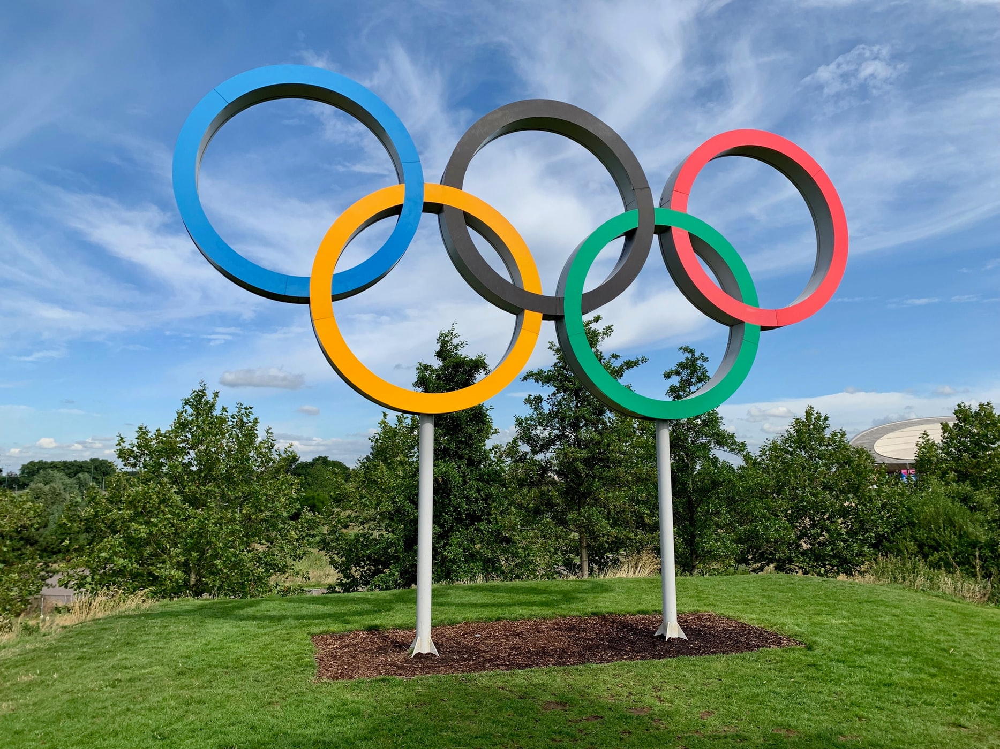

# R_tutorial
### What is R?
> R is a language and environment for statistical computing and graphics.
-------
### This tutorial covers:
* A quick look at R
* How to import data (We will be using the Summer Olympics data)
* How to filter the data
* How to create a table

